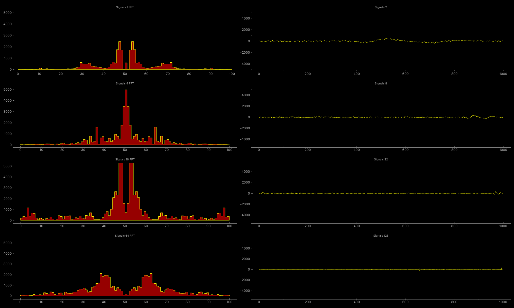

# SoundDancer

Sound Dancer is a Python Tool to visualize your sound, including FFT on the left, and Wave on the right, both in 4 levels .



# Install

```shell
pip install -r requirements.txt
```

* Dependencies: pyaudio, pyqtgraph, PyQt5, and numpy
* Recommended: Python 3.7+

# Usage
```shell
python SoundDancer.py
```

Enjoy it !
